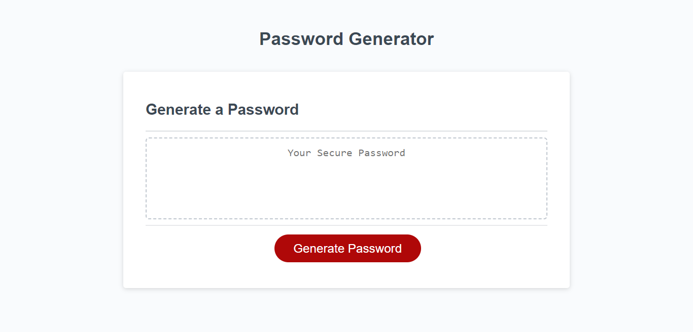

# JS Passwordgen Assignment

## Description
This assignment was completed in order to test my understanding of how JavaScript functions, variables, logic, if/if else statements and objects. In order to have this assignment function correctly, I must comprehend the difference between function declarations and function expressions. I must also recognize how to use if and if-else statments in order to have my code output a password that matches the user selections for length and included characters. This challenge allowed me to demonstrate my comprehension of JavaScript functions, if/if else statements, objects and variables, by creating a functioning password generator webpage.

## Screenshot

## Link
[Passwordgen Live URL](https://sailorshy94.github.io/js-passwordgen-assignment/)